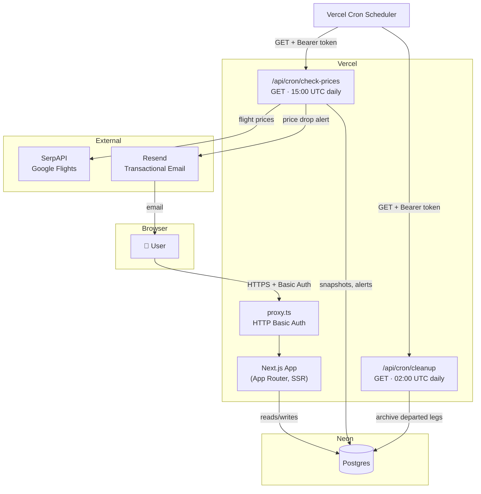
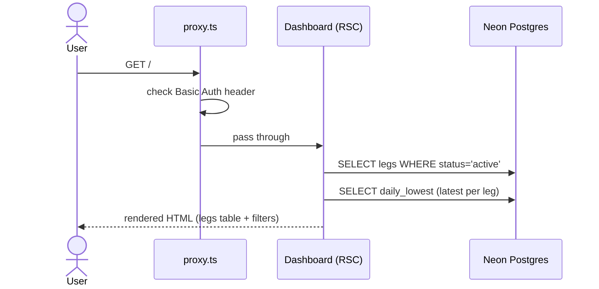
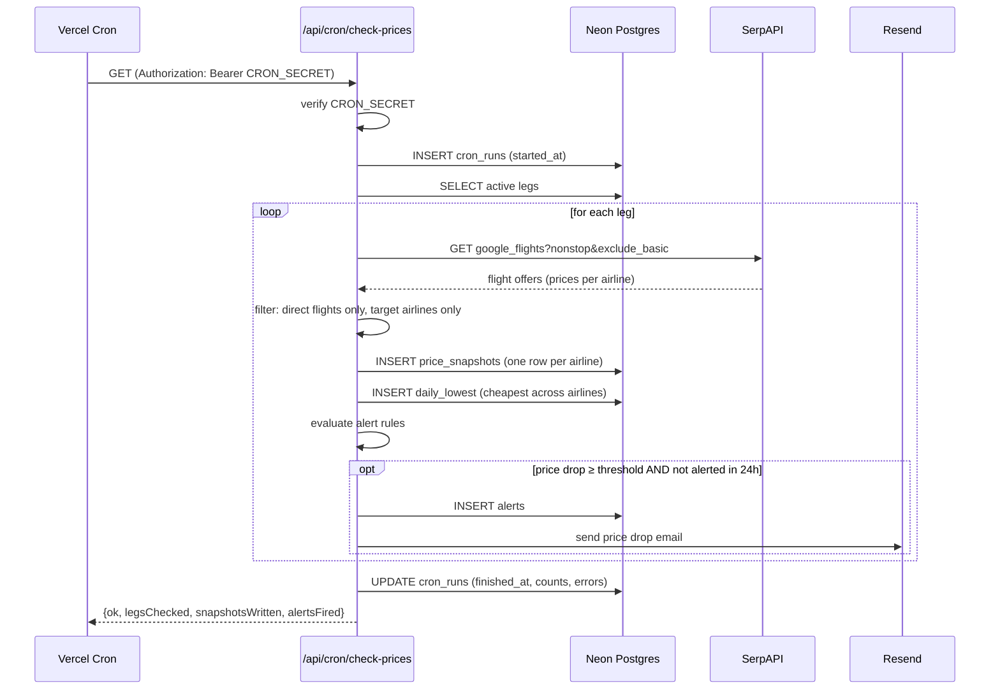
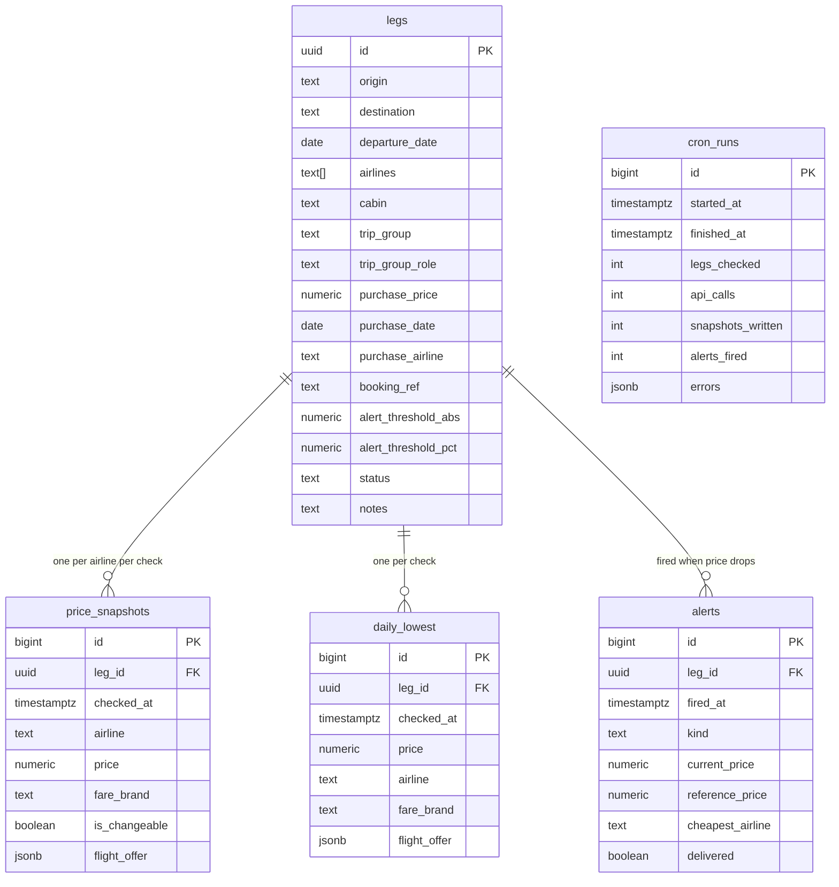
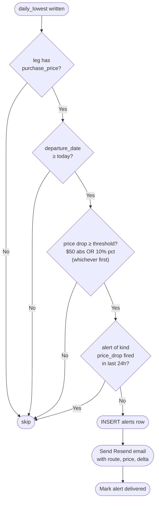
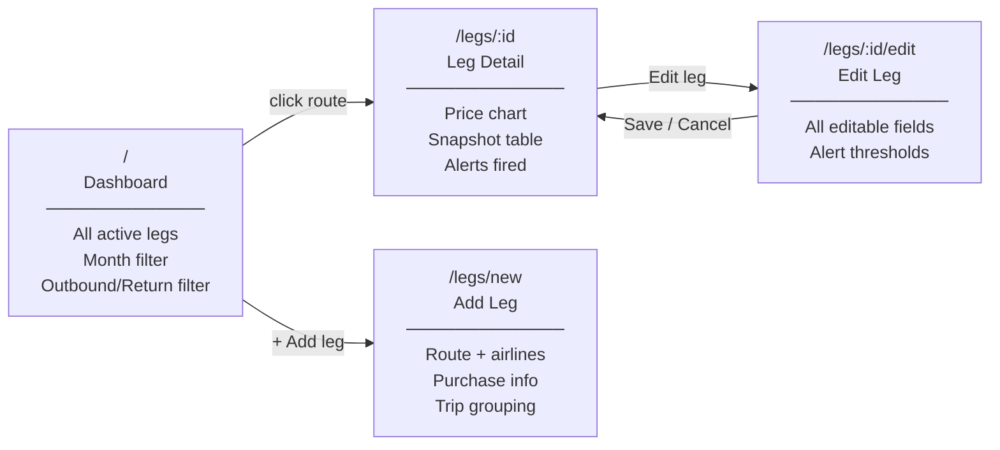

# Flight Tracker — Architecture

## 1. System Overview

The app has three independent parts: a Next.js web UI, a scheduled cron job, and a Postgres database that both share.



---

## 2. Tech Stack

| Layer | Choice | Why |
|---|---|---|
| Framework | Next.js 16 (App Router) | SSR server components + API routes in one project |
| Hosting | Vercel (Hobby) | Free tier, built-in cron scheduler, zero-config deploys |
| Database | Neon (serverless Postgres) | Free tier, works with Vercel via connection string |
| ORM | Drizzle | Type-safe schema-as-code, lightweight |
| Flight prices | SerpAPI (Google Flights) | 250 free calls/month, nonstop filter, exclude basic economy |
| Email | Resend | Simple API, free tier covers alert volume |
| Charts | Recharts | React-native, no canvas setup needed |
| Auth | HTTP Basic Auth (proxy.ts) | Single-user tool — no session management needed |

---

## 3. Request Flows

### 3a. User views the dashboard



### 3b. Cron job runs (daily price check)



---

## 4. Database Schema



**Key design decision:** `price_snapshots` stores one row per airline per check, while `daily_lowest` stores the single best price across all airlines. Alert evaluation reads from `daily_lowest` only — so alerts fire on the overall market low, not per-airline.

---

## 5. Alert Pipeline



**Thresholds** are per-leg overrides, falling back to `$50 OR 10%` defaults. The 24-hour rolling window prevents alert spam on slow-moving markets.

---

## 6. UI Page Map



---

## 7. SerpAPI Filter Chain

Every price check passes through three layers before a price is written to the database:

```
Raw offers from SerpAPI
        │
        ▼
┌───────────────────────┐
│  Direct flights only  │  offer.flights.length === 1
│  (no connections)     │
└──────────┬────────────┘
           │
           ▼
┌───────────────────────┐
│  Target airlines only │  carrier code ∈ leg.airlines
│  (AS, DL, UA)         │
└──────────┬────────────┘
           │
           ▼
┌───────────────────────┐
│  Main cabin only      │  exclude_basic=true (SerpAPI-side)
│  (no basic economy)   │
└──────────┬────────────┘
           │
           ▼
   Qualifying offers
   → price_snapshots (per airline)
   → daily_lowest (cheapest overall)
```

---

## 8. Cron Schedule

| Job | Schedule | UTC | Purpose |
|---|---|---|---|
| `check-prices` | Daily | 15:00 UTC (08:00 PT) | Fetch prices, write snapshots, fire alerts |
| `cleanup` | Daily | 02:00 UTC | Archive legs where `departure_date < today` |

**API budget:** 9 legs × 1 check/day × 30 days = 270 calls/month against a 250/month free quota. Reduce active legs below 8 to stay comfortably within the free tier.
